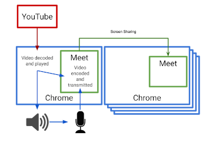
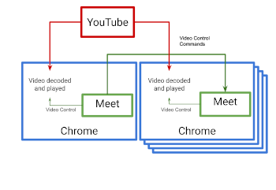

Share Video | Pause video | Play video | Go to timestamp 
--- | --- | ---
`studio721,youtube,${link}` | `studio721,pause,` | `studio721,play,` | `studio721,timeline,${time in seconds}`

# Studio 721
### A Google Chrome extension to provide tools for teachers using Google Meet as a synchronous remote education platform.
This extension was designed by an educator and created by student interns in the [CodeLabs 2020 Intern Program](https://www.srnd.org/codelabs).

This extension is designed as a platform for a number of enhancements that could be made to Google Meet to make it more useful in the educational environment. Many of the features of the extension also have real world uses.

## YouTube Video Sharing (in development)
Nearly all video conferencing platforms require the presenter to play a video locally and share their screen to share it with the audience. This results in poorer quality because the video is recompressed on the presenter's machine and is limited by the video settings of the presenter's computer as driven by their computer's power and internet speed. In addition there are often issues with audio playback based on user and technical errors.

| Currently | Studio 721 |
|-----------|------------|
|  |  |

Studio 721 sees video sharing differently. It coordinates playback of YouTube videos simultaneously on all client machines. This permits the viewer to see the highest possible quality on their computer with no loss of audio.

## Check for Understanding (planned)
In the remote learning environment many body language signals teachers use to gauge understanding are missing or hard to read. Teachers need an easy way to measure how well their students are engaged with the material. This tool allows the teacher to poll the student and the student can privately respond in a simple dialog. The teacher sees the results in an easy to read histogram making checks for understanding frictionless. No more asking, "does this make sense?" and only getting responses from the front row.

## Quick Polls (planned)
Teachers can poll students and check for understanding through predefined Google Forms or a simple automatically created one question form. Students see the question appear directly in Meet and teachers get the responses in a dialog. This provides a way to explicitly check for understanding, provide for student choice or even easily group students. Results are saved in the Google Form and can be reviewed later.

## Presentation Sharing (planned)
Everyone shares slides during videoconferences and, much like video, these slides can suffer from problems from being encoded as video and displayed to the viewer. Instead Studio 721 intends to display the Google Slides Presenter view to the presenter and the presentation view to each participant is opened directly in Meet, not from a video. In addition both the teacher and students have easy access from within Meet to the Google Slides Q&A tool.

This tool could be extended to support the dual screen experience of add ons like [Pear Deck](https://peardeck.com).

